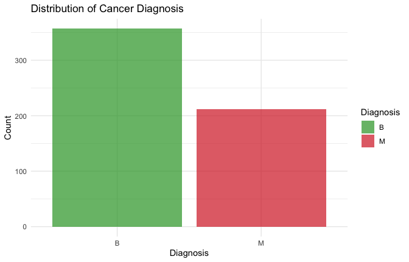
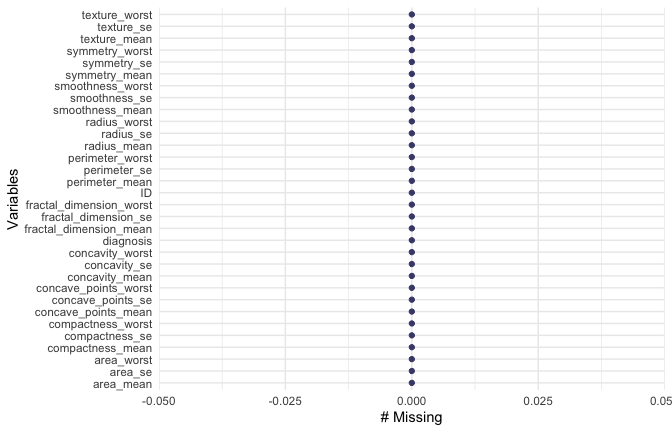
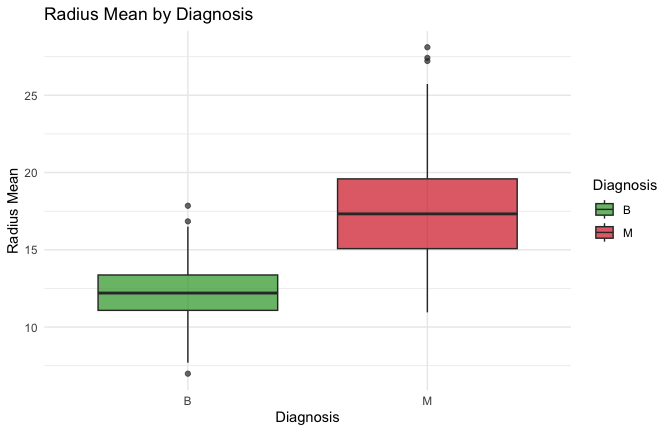
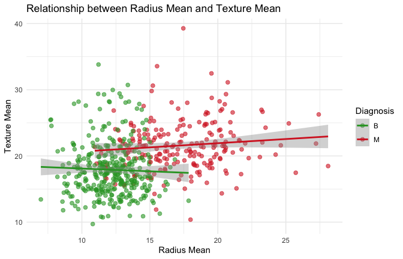

Mini Data Analysis 1 - Zahra Alipour
================
Zahra Alipour

**STAT 545A: Mini Data Analysis Deliverable 1**  
**Student: Zahra Alipour**  
**Date: December 2024**

# Task 1: Choose and explore 4 datasets from datateachr

In this task, I will explore 4 datasets from the `datateachr` package to
understand their structure and choose one for further analysis.

## Exploring the datasets

I examined the available datasets and explored their basic structure:

``` r
# Check what datasets are available in datateachr
data(package = "datateachr")

# Explore apt_buildings
glimpse(apt_buildings)
```

    ## Rows: 3,455
    ## Columns: 37
    ## $ id                               <dbl> 10359, 10360, 10361, 10362, 10363, 10…
    ## $ air_conditioning                 <chr> "NONE", "NONE", "NONE", "NONE", "NONE…
    ## $ amenities                        <chr> "Outdoor rec facilities", "Outdoor po…
    ## $ balconies                        <chr> "YES", "YES", "YES", "YES", "NO", "NO…
    ## $ barrier_free_accessibilty_entr   <chr> "YES", "NO", "NO", "YES", "NO", "NO",…
    ## $ bike_parking                     <chr> "0 indoor parking spots and 10 outdoo…
    ## $ exterior_fire_escape             <chr> "NO", "NO", "NO", "YES", "NO", NA, "N…
    ## $ fire_alarm                       <chr> "YES", "YES", "YES", "YES", "YES", "Y…
    ## $ garbage_chutes                   <chr> "YES", "YES", "NO", "NO", "NO", "NO",…
    ## $ heating_type                     <chr> "HOT WATER", "HOT WATER", "HOT WATER"…
    ## $ intercom                         <chr> "YES", "YES", "YES", "YES", "YES", "Y…
    ## $ laundry_room                     <chr> "YES", "YES", "YES", "YES", "YES", "Y…
    ## $ locker_or_storage_room           <chr> "NO", "YES", "YES", "YES", "NO", "YES…
    ## $ no_of_elevators                  <dbl> 3, 3, 0, 1, 0, 0, 0, 2, 4, 2, 0, 2, 2…
    ## $ parking_type                     <chr> "Underground Garage , Garage accessib…
    ## $ pets_allowed                     <chr> "YES", "YES", "YES", "YES", "YES", "Y…
    ## $ prop_management_company_name     <chr> NA, "SCHICKEDANZ BROS. PROPERTIES", N…
    ## $ property_type                    <chr> "PRIVATE", "PRIVATE", "PRIVATE", "PRI…
    ## $ rsn                              <dbl> 4154812, 4154815, 4155295, 4155309, 4…
    ## $ separate_gas_meters              <chr> "NO", "NO", "NO", "NO", "NO", "NO", "…
    ## $ separate_hydro_meters            <chr> "YES", "YES", "YES", "YES", "YES", "Y…
    ## $ separate_water_meters            <chr> "NO", "NO", "NO", "NO", "NO", "NO", "…
    ## $ site_address                     <chr> "65  FOREST MANOR RD", "70  CLIPPER R…
    ## $ sprinkler_system                 <chr> "YES", "YES", "NO", "YES", "NO", "NO"…
    ## $ visitor_parking                  <chr> "PAID", "FREE", "UNAVAILABLE", "UNAVA…
    ## $ ward                             <chr> "17", "17", "03", "03", "02", "02", "…
    ## $ window_type                      <chr> "DOUBLE PANE", "DOUBLE PANE", "DOUBLE…
    ## $ year_built                       <dbl> 1967, 1970, 1927, 1959, 1943, 1952, 1…
    ## $ year_registered                  <dbl> 2017, 2017, 2017, 2017, 2017, NA, 201…
    ## $ no_of_storeys                    <dbl> 17, 14, 4, 5, 4, 4, 4, 7, 32, 4, 4, 7…
    ## $ emergency_power                  <chr> "NO", "YES", "NO", "NO", "NO", "NO", …
    ## $ `non-smoking_building`           <chr> "YES", "NO", "YES", "YES", "YES", "NO…
    ## $ no_of_units                      <dbl> 218, 206, 34, 42, 25, 34, 14, 105, 57…
    ## $ no_of_accessible_parking_spaces  <dbl> 8, 10, 20, 42, 12, 0, 5, 1, 1, 6, 12,…
    ## $ facilities_available             <chr> "Recycling bins", "Green Bin / Organi…
    ## $ cooling_room                     <chr> "NO", "NO", "NO", "NO", "NO", "NO", "…
    ## $ no_barrier_free_accessible_units <dbl> 2, 0, 0, 42, 0, NA, 14, 0, 0, 1, 25, …

``` r
nrow(apt_buildings)
```

    ## [1] 3455

``` r
ncol(apt_buildings)
```

    ## [1] 37

``` r
summary(apt_buildings)
```

    ##        id        air_conditioning    amenities          balconies        
    ##  Min.   :10359   Length:3455        Length:3455        Length:3455       
    ##  1st Qu.:11222   Class :character   Class :character   Class :character  
    ##  Median :12086   Mode  :character   Mode  :character   Mode  :character  
    ##  Mean   :12086                                                           
    ##  3rd Qu.:12950                                                           
    ##  Max.   :13813                                                           
    ##                                                                          
    ##  barrier_free_accessibilty_entr bike_parking       exterior_fire_escape
    ##  Length:3455                    Length:3455        Length:3455         
    ##  Class :character               Class :character   Class :character    
    ##  Mode  :character               Mode  :character   Mode  :character    
    ##                                                                        
    ##                                                                        
    ##                                                                        
    ##                                                                        
    ##   fire_alarm        garbage_chutes     heating_type         intercom        
    ##  Length:3455        Length:3455        Length:3455        Length:3455       
    ##  Class :character   Class :character   Class :character   Class :character  
    ##  Mode  :character   Mode  :character   Mode  :character   Mode  :character  
    ##                                                                             
    ##                                                                             
    ##                                                                             
    ##                                                                             
    ##  laundry_room       locker_or_storage_room no_of_elevators  parking_type      
    ##  Length:3455        Length:3455            Min.   : 0.000   Length:3455       
    ##  Class :character   Class :character       1st Qu.: 0.000   Class :character  
    ##  Mode  :character   Mode  :character       Median : 1.000   Mode  :character  
    ##                                            Mean   : 1.208                     
    ##                                            3rd Qu.: 2.000                     
    ##                                            Max.   :32.000                     
    ##                                            NA's   :5                          
    ##  pets_allowed       prop_management_company_name property_type     
    ##  Length:3455        Length:3455                  Length:3455       
    ##  Class :character   Class :character             Class :character  
    ##  Mode  :character   Mode  :character             Mode  :character  
    ##                                                                    
    ##                                                                    
    ##                                                                    
    ##                                                                    
    ##       rsn          separate_gas_meters separate_hydro_meters
    ##  Min.   :4152554   Length:3455         Length:3455          
    ##  1st Qu.:4153682   Class :character    Class :character     
    ##  Median :4154598   Mode  :character    Mode  :character     
    ##  Mean   :4167867                                            
    ##  3rd Qu.:4155538                                            
    ##  Max.   :4716349                                            
    ##                                                             
    ##  separate_water_meters site_address       sprinkler_system   visitor_parking   
    ##  Length:3455           Length:3455        Length:3455        Length:3455       
    ##  Class :character      Class :character   Class :character   Class :character  
    ##  Mode  :character      Mode  :character   Mode  :character   Mode  :character  
    ##                                                                                
    ##                                                                                
    ##                                                                                
    ##                                                                                
    ##      ward           window_type          year_built   year_registered
    ##  Length:3455        Length:3455        Min.   :1805   Min.   :2017   
    ##  Class :character   Class :character   1st Qu.:1955   1st Qu.:2017   
    ##  Mode  :character   Mode  :character   Median :1962   Median :2017   
    ##                                        Mean   :1962   Mean   :2017   
    ##                                        3rd Qu.:1970   3rd Qu.:2017   
    ##                                        Max.   :2019   Max.   :2020   
    ##                                        NA's   :13     NA's   :89     
    ##  no_of_storeys    emergency_power    non-smoking_building  no_of_units     
    ##  Min.   : 0.000   Length:3455        Length:3455          Min.   :   0.00  
    ##  1st Qu.: 3.000   Class :character   Class :character     1st Qu.:  25.00  
    ##  Median : 5.000   Mode  :character   Mode  :character     Median :  52.00  
    ##  Mean   : 7.738                                           Mean   :  91.09  
    ##  3rd Qu.:10.000                                           3rd Qu.: 124.00  
    ##  Max.   :51.000                                           Max.   :4111.00  
    ##                                                                            
    ##  no_of_accessible_parking_spaces facilities_available cooling_room      
    ##  Min.   :  0.000                 Length:3455          Length:3455       
    ##  1st Qu.:  0.000                 Class :character     Class :character  
    ##  Median :  1.000                 Mode  :character     Mode  :character  
    ##  Mean   :  6.559                                                        
    ##  3rd Qu.:  5.000                                                        
    ##  Max.   :340.000                                                        
    ##  NA's   :123                                                            
    ##  no_barrier_free_accessible_units
    ##  Min.   :  0.000                 
    ##  1st Qu.:  0.000                 
    ##  Median :  0.000                 
    ##  Mean   :  9.408                 
    ##  3rd Qu.:  1.000                 
    ##  Max.   :474.000                 
    ##  NA's   :154

``` r
# Explore building_permits
glimpse(building_permits)
```

    ## Rows: 20,680
    ## Columns: 14
    ## $ permit_number               <chr> "BP-2016-02248", "BU468090", "DB-2016-0445…
    ## $ issue_date                  <date> 2017-02-01, 2017-02-01, 2017-02-01, 2017-…
    ## $ project_value               <dbl> 0, 0, 35000, 15000, 181178, 0, 15000, 0, 6…
    ## $ type_of_work                <chr> "Salvage and Abatement", "New Building", "…
    ## $ address                     <chr> "4378 W 9TH AVENUE, Vancouver, BC V6R 2C7"…
    ## $ project_description         <chr> NA, NA, NA, NA, NA, NA, NA, NA, NA, NA, NA…
    ## $ building_contractor         <chr> NA, NA, NA, "Mercury Contracting Ltd", "08…
    ## $ building_contractor_address <chr> NA, NA, NA, "88 W PENDER ST  \r\nUnit 2069…
    ## $ applicant                   <chr> "Raffaele & Associates DBA: Raffaele and A…
    ## $ applicant_address           <chr> "2642 East Hastings\r\nVancouver, BC  V5K …
    ## $ property_use                <chr> "Dwelling Uses", "Dwelling Uses", "Dwellin…
    ## $ specific_use_category       <chr> "One-Family Dwelling", "Multiple Dwelling"…
    ## $ year                        <dbl> 2017, 2017, 2017, 2017, 2017, 2017, 2017, …
    ## $ bi_id                       <dbl> 524, 535, 539, 541, 543, 546, 547, 548, 54…

``` r
nrow(building_permits)
```

    ## [1] 20680

``` r
ncol(building_permits)
```

    ## [1] 14

``` r
summary(building_permits)
```

    ##  permit_number        issue_date         project_value       type_of_work      
    ##  Length:20680       Min.   :2017-01-03   Min.   :        0   Length:20680      
    ##  Class :character   1st Qu.:2017-09-25   1st Qu.:    10739   Class :character  
    ##  Mode  :character   Median :2018-07-18   Median :    48000   Mode  :character  
    ##                     Mean   :2018-07-24   Mean   :   609166                     
    ##                     3rd Qu.:2019-05-13   3rd Qu.:   217791                     
    ##                     Max.   :2020-04-29   Max.   :807185500                     
    ##                                          NA's   :52                            
    ##    address          project_description building_contractor
    ##  Length:20680       Length:20680        Length:20680       
    ##  Class :character   Class :character    Class :character   
    ##  Mode  :character   Mode  :character    Mode  :character   
    ##                                                            
    ##                                                            
    ##                                                            
    ##                                                            
    ##  building_contractor_address  applicant         applicant_address 
    ##  Length:20680                Length:20680       Length:20680      
    ##  Class :character            Class :character   Class :character  
    ##  Mode  :character            Mode  :character   Mode  :character  
    ##                                                                   
    ##                                                                   
    ##                                                                   
    ##                                                                   
    ##  property_use       specific_use_category      year          bi_id      
    ##  Length:20680       Length:20680          Min.   :2017   Min.   :    1  
    ##  Class :character   Class :character      1st Qu.:2017   1st Qu.: 5171  
    ##  Mode  :character   Mode  :character      Median :2018   Median :10340  
    ##                                           Mean   :2018   Mean   :10340  
    ##                                           3rd Qu.:2019   3rd Qu.:15510  
    ##                                           Max.   :2020   Max.   :20680  
    ## 

``` r
# Explore cancer_sample
glimpse(cancer_sample)
```

    ## Rows: 569
    ## Columns: 32
    ## $ ID                      <dbl> 842302, 842517, 84300903, 84348301, 84358402, …
    ## $ diagnosis               <fct> M, M, M, M, M, M, M, M, M, M, M, M, M, M, M, M…
    ## $ radius_mean             <dbl> 17.990, 20.570, 19.690, 11.420, 20.290, 12.450…
    ## $ texture_mean            <dbl> 10.38, 17.77, 21.25, 20.38, 14.34, 15.70, 19.9…
    ## $ perimeter_mean          <dbl> 122.80, 132.90, 130.00, 77.58, 135.10, 82.57, …
    ## $ area_mean               <dbl> 1001.0, 1326.0, 1203.0, 386.1, 1297.0, 477.1, …
    ## $ smoothness_mean         <dbl> 0.11840, 0.08474, 0.10960, 0.14250, 0.10030, 0…
    ## $ compactness_mean        <dbl> 0.27760, 0.07864, 0.15990, 0.28390, 0.13280, 0…
    ## $ concavity_mean          <dbl> 0.30010, 0.08690, 0.19740, 0.24140, 0.19800, 0…
    ## $ concave_points_mean     <dbl> 0.14710, 0.07017, 0.12790, 0.10520, 0.10430, 0…
    ## $ symmetry_mean           <dbl> 0.2419, 0.1812, 0.2069, 0.2597, 0.1809, 0.2087…
    ## $ fractal_dimension_mean  <dbl> 0.07871, 0.05667, 0.05999, 0.09744, 0.05883, 0…
    ## $ radius_se               <dbl> 1.0950, 0.5435, 0.7456, 0.4956, 0.7572, 0.3345…
    ## $ texture_se              <dbl> 0.9053, 0.7339, 0.7869, 1.1560, 0.7813, 0.8902…
    ## $ perimeter_se            <dbl> 8.589, 3.398, 4.585, 3.445, 5.438, 2.217, 3.18…
    ## $ area_se                 <dbl> 153.40, 74.08, 94.03, 27.23, 94.44, 27.19, 53.…
    ## $ smoothness_se           <dbl> 0.006399, 0.005225, 0.006150, 0.009110, 0.0114…
    ## $ compactness_se          <dbl> 0.049040, 0.013080, 0.040060, 0.074580, 0.0246…
    ## $ concavity_se            <dbl> 0.05373, 0.01860, 0.03832, 0.05661, 0.05688, 0…
    ## $ concave_points_se       <dbl> 0.015870, 0.013400, 0.020580, 0.018670, 0.0188…
    ## $ symmetry_se             <dbl> 0.03003, 0.01389, 0.02250, 0.05963, 0.01756, 0…
    ## $ fractal_dimension_se    <dbl> 0.006193, 0.003532, 0.004571, 0.009208, 0.0051…
    ## $ radius_worst            <dbl> 25.38, 24.99, 23.57, 14.91, 22.54, 15.47, 22.8…
    ## $ texture_worst           <dbl> 17.33, 23.41, 25.53, 26.50, 16.67, 23.75, 27.6…
    ## $ perimeter_worst         <dbl> 184.60, 158.80, 152.50, 98.87, 152.20, 103.40,…
    ## $ area_worst              <dbl> 2019.0, 1956.0, 1709.0, 567.7, 1575.0, 741.6, …
    ## $ smoothness_worst        <dbl> 0.1622, 0.1238, 0.1444, 0.2098, 0.1374, 0.1791…
    ## $ compactness_worst       <dbl> 0.6656, 0.1866, 0.4245, 0.8663, 0.2050, 0.5249…
    ## $ concavity_worst         <dbl> 0.71190, 0.24160, 0.45040, 0.68690, 0.40000, 0…
    ## $ concave_points_worst    <dbl> 0.26540, 0.18600, 0.24300, 0.25750, 0.16250, 0…
    ## $ symmetry_worst          <dbl> 0.4601, 0.2750, 0.3613, 0.6638, 0.2364, 0.3985…
    ## $ fractal_dimension_worst <dbl> 0.11890, 0.08902, 0.08758, 0.17300, 0.07678, 0…

``` r
nrow(cancer_sample)
```

    ## [1] 569

``` r
ncol(cancer_sample)
```

    ## [1] 32

``` r
summary(cancer_sample)
```

    ##        ID            diagnosis  radius_mean      texture_mean  
    ##  Min.   :     8670   B:357     Min.   : 6.981   Min.   : 9.71  
    ##  1st Qu.:   869218   M:212     1st Qu.:11.700   1st Qu.:16.17  
    ##  Median :   906024             Median :13.370   Median :18.84  
    ##  Mean   : 30371831             Mean   :14.127   Mean   :19.29  
    ##  3rd Qu.:  8813129             3rd Qu.:15.780   3rd Qu.:21.80  
    ##  Max.   :911320502             Max.   :28.110   Max.   :39.28  
    ##  perimeter_mean     area_mean      smoothness_mean   compactness_mean 
    ##  Min.   : 43.79   Min.   : 143.5   Min.   :0.05263   Min.   :0.01938  
    ##  1st Qu.: 75.17   1st Qu.: 420.3   1st Qu.:0.08637   1st Qu.:0.06492  
    ##  Median : 86.24   Median : 551.1   Median :0.09587   Median :0.09263  
    ##  Mean   : 91.97   Mean   : 654.9   Mean   :0.09636   Mean   :0.10434  
    ##  3rd Qu.:104.10   3rd Qu.: 782.7   3rd Qu.:0.10530   3rd Qu.:0.13040  
    ##  Max.   :188.50   Max.   :2501.0   Max.   :0.16340   Max.   :0.34540  
    ##  concavity_mean    concave_points_mean symmetry_mean    fractal_dimension_mean
    ##  Min.   :0.00000   Min.   :0.00000     Min.   :0.1060   Min.   :0.04996       
    ##  1st Qu.:0.02956   1st Qu.:0.02031     1st Qu.:0.1619   1st Qu.:0.05770       
    ##  Median :0.06154   Median :0.03350     Median :0.1792   Median :0.06154       
    ##  Mean   :0.08880   Mean   :0.04892     Mean   :0.1812   Mean   :0.06280       
    ##  3rd Qu.:0.13070   3rd Qu.:0.07400     3rd Qu.:0.1957   3rd Qu.:0.06612       
    ##  Max.   :0.42680   Max.   :0.20120     Max.   :0.3040   Max.   :0.09744       
    ##    radius_se        texture_se      perimeter_se       area_se       
    ##  Min.   :0.1115   Min.   :0.3602   Min.   : 0.757   Min.   :  6.802  
    ##  1st Qu.:0.2324   1st Qu.:0.8339   1st Qu.: 1.606   1st Qu.: 17.850  
    ##  Median :0.3242   Median :1.1080   Median : 2.287   Median : 24.530  
    ##  Mean   :0.4052   Mean   :1.2169   Mean   : 2.866   Mean   : 40.337  
    ##  3rd Qu.:0.4789   3rd Qu.:1.4740   3rd Qu.: 3.357   3rd Qu.: 45.190  
    ##  Max.   :2.8730   Max.   :4.8850   Max.   :21.980   Max.   :542.200  
    ##  smoothness_se      compactness_se      concavity_se     concave_points_se 
    ##  Min.   :0.001713   Min.   :0.002252   Min.   :0.00000   Min.   :0.000000  
    ##  1st Qu.:0.005169   1st Qu.:0.013080   1st Qu.:0.01509   1st Qu.:0.007638  
    ##  Median :0.006380   Median :0.020450   Median :0.02589   Median :0.010930  
    ##  Mean   :0.007041   Mean   :0.025478   Mean   :0.03189   Mean   :0.011796  
    ##  3rd Qu.:0.008146   3rd Qu.:0.032450   3rd Qu.:0.04205   3rd Qu.:0.014710  
    ##  Max.   :0.031130   Max.   :0.135400   Max.   :0.39600   Max.   :0.052790  
    ##   symmetry_se       fractal_dimension_se  radius_worst   texture_worst  
    ##  Min.   :0.007882   Min.   :0.0008948    Min.   : 7.93   Min.   :12.02  
    ##  1st Qu.:0.015160   1st Qu.:0.0022480    1st Qu.:13.01   1st Qu.:21.08  
    ##  Median :0.018730   Median :0.0031870    Median :14.97   Median :25.41  
    ##  Mean   :0.020542   Mean   :0.0037949    Mean   :16.27   Mean   :25.68  
    ##  3rd Qu.:0.023480   3rd Qu.:0.0045580    3rd Qu.:18.79   3rd Qu.:29.72  
    ##  Max.   :0.078950   Max.   :0.0298400    Max.   :36.04   Max.   :49.54  
    ##  perimeter_worst    area_worst     smoothness_worst  compactness_worst
    ##  Min.   : 50.41   Min.   : 185.2   Min.   :0.07117   Min.   :0.02729  
    ##  1st Qu.: 84.11   1st Qu.: 515.3   1st Qu.:0.11660   1st Qu.:0.14720  
    ##  Median : 97.66   Median : 686.5   Median :0.13130   Median :0.21190  
    ##  Mean   :107.26   Mean   : 880.6   Mean   :0.13237   Mean   :0.25427  
    ##  3rd Qu.:125.40   3rd Qu.:1084.0   3rd Qu.:0.14600   3rd Qu.:0.33910  
    ##  Max.   :251.20   Max.   :4254.0   Max.   :0.22260   Max.   :1.05800  
    ##  concavity_worst  concave_points_worst symmetry_worst   fractal_dimension_worst
    ##  Min.   :0.0000   Min.   :0.00000      Min.   :0.1565   Min.   :0.05504        
    ##  1st Qu.:0.1145   1st Qu.:0.06493      1st Qu.:0.2504   1st Qu.:0.07146        
    ##  Median :0.2267   Median :0.09993      Median :0.2822   Median :0.08004        
    ##  Mean   :0.2722   Mean   :0.11461      Mean   :0.2901   Mean   :0.08395        
    ##  3rd Qu.:0.3829   3rd Qu.:0.16140      3rd Qu.:0.3179   3rd Qu.:0.09208        
    ##  Max.   :1.2520   Max.   :0.29100      Max.   :0.6638   Max.   :0.20750

``` r
# Explore steam_games
glimpse(steam_games)
```

    ## Rows: 40,833
    ## Columns: 21
    ## $ id                       <dbl> 1, 2, 3, 4, 5, 6, 7, 8, 9, 10, 11, 12, 13, 14…
    ## $ url                      <chr> "https://store.steampowered.com/app/379720/DO…
    ## $ types                    <chr> "app", "app", "app", "app", "app", "bundle", …
    ## $ name                     <chr> "DOOM", "PLAYERUNKNOWN'S BATTLEGROUNDS", "BAT…
    ## $ desc_snippet             <chr> "Now includes all three premium DLC packs (Un…
    ## $ recent_reviews           <chr> "Very Positive,(554),- 89% of the 554 user re…
    ## $ all_reviews              <chr> "Very Positive,(42,550),- 92% of the 42,550 u…
    ## $ release_date             <chr> "May 12, 2016", "Dec 21, 2017", "Apr 24, 2018…
    ## $ developer                <chr> "id Software", "PUBG Corporation", "Harebrain…
    ## $ publisher                <chr> "Bethesda Softworks,Bethesda Softworks", "PUB…
    ## $ popular_tags             <chr> "FPS,Gore,Action,Demons,Shooter,First-Person,…
    ## $ game_details             <chr> "Single-player,Multi-player,Co-op,Steam Achie…
    ## $ languages                <chr> "English,French,Italian,German,Spanish - Spai…
    ## $ achievements             <dbl> 54, 37, 128, NA, NA, NA, 51, 55, 34, 43, 72, …
    ## $ genre                    <chr> "Action", "Action,Adventure,Massively Multipl…
    ## $ game_description         <chr> "About This Game Developed by id software, th…
    ## $ mature_content           <chr> NA, "Mature Content Description  The develope…
    ## $ minimum_requirements     <chr> "Minimum:,OS:,Windows 7/8.1/10 (64-bit versio…
    ## $ recommended_requirements <chr> "Recommended:,OS:,Windows 7/8.1/10 (64-bit ve…
    ## $ original_price           <dbl> 19.99, 29.99, 39.99, 44.99, 0.00, NA, 59.99, …
    ## $ discount_price           <dbl> 14.99, NA, NA, NA, NA, 35.18, 70.42, 17.58, N…

``` r
nrow(steam_games)
```

    ## [1] 40833

``` r
ncol(steam_games)
```

    ## [1] 21

``` r
summary(steam_games)
```

    ##        id            url               types               name          
    ##  Min.   :    1   Length:40833       Length:40833       Length:40833      
    ##  1st Qu.:10209   Class :character   Class :character   Class :character  
    ##  Median :20417   Mode  :character   Mode  :character   Mode  :character  
    ##  Mean   :20417                                                           
    ##  3rd Qu.:30625                                                           
    ##  Max.   :40833                                                           
    ##                                                                          
    ##  desc_snippet       recent_reviews     all_reviews        release_date      
    ##  Length:40833       Length:40833       Length:40833       Length:40833      
    ##  Class :character   Class :character   Class :character   Class :character  
    ##  Mode  :character   Mode  :character   Mode  :character   Mode  :character  
    ##                                                                             
    ##                                                                             
    ##                                                                             
    ##                                                                             
    ##   developer          publisher         popular_tags       game_details      
    ##  Length:40833       Length:40833       Length:40833       Length:40833      
    ##  Class :character   Class :character   Class :character   Class :character  
    ##  Mode  :character   Mode  :character   Mode  :character   Mode  :character  
    ##                                                                             
    ##                                                                             
    ##                                                                             
    ##                                                                             
    ##   languages          achievements        genre           game_description  
    ##  Length:40833       Min.   :   1.00   Length:40833       Length:40833      
    ##  Class :character   1st Qu.:  12.00   Class :character   Class :character  
    ##  Mode  :character   Median :  21.00   Mode  :character   Mode  :character  
    ##                     Mean   :  77.24                                        
    ##                     3rd Qu.:  38.00                                        
    ##                     Max.   :9821.00                                        
    ##                     NA's   :28639                                          
    ##  mature_content     minimum_requirements recommended_requirements
    ##  Length:40833       Length:40833         Length:40833            
    ##  Class :character   Class :character     Class :character        
    ##  Mode  :character   Mode  :character     Mode  :character        
    ##                                                                  
    ##                                                                  
    ##                                                                  
    ##                                                                  
    ##  original_price      discount_price  
    ##  Min.   :     0.00   Min.   :  0.00  
    ##  1st Qu.:     1.99   1st Qu.:  8.78  
    ##  Median :     4.99   Median : 19.98  
    ##  Mean   :    53.05   Mean   : 46.82  
    ##  3rd Qu.:     9.99   3rd Qu.: 43.92  
    ##  Max.   :730640.00   Max.   :962.60  
    ##  NA's   :5353        NA's   :26290

## Dataset Choice and Justification

After exploring these datasets, I chose the **cancer\_sample** dataset
for the following reasons:

1.  **Manageable size**: With 569 observations and 32 variables, it’s a
    good size for analysis
2.  **Clear structure**: It has a mix of numerical and categorical
    variables that will allow for diverse exploration
3.  **Medical relevance**: Cancer research is important and the dataset
    appears to contain diagnostic measurements
4.  **Good for visualization**: The numerical variables will work well
    with ggplot2 for creating meaningful plots

## Initial Research Question

**How do the various diagnostic measurements (radius, texture,
perimeter, etc.) differ between malignant and benign cancer samples?**

# Task 2: Perform 4 exploration exercises

I performed 4 different exploration exercises on the `cancer_sample`
dataset using dplyr and ggplot2.

## Exercise 1: Distribution of diagnosis (target variable)

I first examined the distribution of the diagnosis variable to
understand the balance of malignant vs benign cases.

``` r
# Get counts and proportions
cs_counts <- count(cancer_sample, diagnosis) |> mutate(prop = round(n/sum(n),3))
cs_counts
```

    ## # A tibble: 2 × 3
    ##   diagnosis     n  prop
    ##   <fct>     <int> <dbl>
    ## 1 B           357 0.627
    ## 2 M           212 0.373

``` r
# Check the distribution of diagnosis
cancer_sample %>%
  count(diagnosis) %>%
  mutate(proportion = n / sum(n))
```

    ## # A tibble: 2 × 3
    ##   diagnosis     n proportion
    ##   <fct>     <int>      <dbl>
    ## 1 B           357      0.627
    ## 2 M           212      0.373

``` r
# Create a bar plot of diagnosis distribution
ggplot(cancer_sample, aes(x = diagnosis, fill = diagnosis)) +
  geom_bar(alpha = 0.7) +
  labs(title = "Distribution of Cancer Diagnosis",
       x = "Diagnosis",
       y = "Count",
       fill = "Diagnosis") +
  theme_minimal() +
  scale_fill_manual(values = c("M" = "#d62728", "B" = "#2ca02c"))
```

<!-- -->

**Explanation**: The plot shows the distribution of malignant (M) vs
benign (B) cancer diagnoses. This helps us understand the class balance
in our dataset, which is important for any subsequent analysis.

## Exercise 2: Missing value analysis

I checked for missing values across all variables in the dataset.

``` r
# Use naniar if available; otherwise do base/tidyverse version
has_naniar <- requireNamespace("naniar", quietly = TRUE)

# Check for missing values using modern dplyr approach
missing_summary <- cancer_sample %>%
  summarise(across(everything(), ~ sum(is.na(.)), .names = "{.col}")) %>%
  tidyr::pivot_longer(everything(), names_to = "variable", values_to = "missing_count") %>%
  arrange(desc(missing_count))

# Display missing value summary
missing_summary
```

    ## # A tibble: 32 × 2
    ##    variable            missing_count
    ##    <chr>                       <int>
    ##  1 ID                              0
    ##  2 diagnosis                       0
    ##  3 radius_mean                     0
    ##  4 texture_mean                    0
    ##  5 perimeter_mean                  0
    ##  6 area_mean                       0
    ##  7 smoothness_mean                 0
    ##  8 compactness_mean                0
    ##  9 concavity_mean                  0
    ## 10 concave_points_mean             0
    ## # ℹ 22 more rows

``` r
# Show total missing values
total_missing <- sum(missing_summary$missing_count)
cat("Total missing values in the dataset:", total_missing, "\n")
```

    ## Total missing values in the dataset: 0

``` r
# Use naniar's professional missing data visualization if available
if (has_naniar) {
  naniar::vis_miss(cancer_sample, warn_large_data = FALSE)
  naniar::gg_miss_var(cancer_sample)
}
```

<!-- -->

**Explanation**: This analysis shows that the cancer\_sample dataset has
no missing values across any of its 32 variables. This is excellent for
analysis, as we won’t need to decide how to handle missing data or worry
about incomplete observations affecting our results.

## Exercise 3: Filtering and summary statistics

I filtered the data to compare malignant vs benign cases for a specific
measurement (radius\_mean).

``` r
# Filter and compare radius_mean between malignant and benign
radius_comparison <- cancer_sample %>%
  group_by(diagnosis) %>%
  summarise(
    count = n(),
    mean_radius = mean(radius_mean),
    median_radius = median(radius_mean),
    sd_radius = sd(radius_mean),
    min_radius = min(radius_mean),
    max_radius = max(radius_mean)
  )

# Display the comparison
radius_comparison
```

    ## # A tibble: 2 × 7
    ##   diagnosis count mean_radius median_radius sd_radius min_radius max_radius
    ##   <fct>     <int>       <dbl>         <dbl>     <dbl>      <dbl>      <dbl>
    ## 1 B           357        12.1          12.2      1.78       6.98       17.8
    ## 2 M           212        17.5          17.3      3.20      11.0        28.1

``` r
# Inline statistics for clarity
glue("Mean radius (Benign) = {round(radius_comparison$mean_radius[radius_comparison$diagnosis=='B'],2)}, ",
     "Mean radius (Malignant) = {round(radius_comparison$mean_radius[radius_comparison$diagnosis=='M'],2)}")
```

    ## Mean radius (Benign) = 12.15, Mean radius (Malignant) = 17.46

``` r
# Create a box plot to visualize the distribution
ggplot(cancer_sample, aes(x = diagnosis, y = radius_mean, fill = diagnosis)) +
  geom_boxplot(alpha = 0.7) +
  labs(title = "Radius Mean by Diagnosis",
       x = "Diagnosis",
       y = "Radius Mean",
       fill = "Diagnosis") +
  theme_minimal() +
  scale_fill_manual(values = c("M" = "#d62728", "B" = "#2ca02c"))
```

<!-- -->

**Explanation**: This filtering exercise shows that malignant tumors
tend to have larger mean radius values than benign tumors. The box plot
clearly visualizes this difference, with malignant cases showing higher
median and spread of radius measurements.

## Exercise 4: Relationship between variables

I explored the relationship between two key measurements: radius\_mean
and texture\_mean.

``` r
# Create a scatter plot showing relationship between radius_mean and texture_mean
ggplot(cancer_sample, aes(x = radius_mean, y = texture_mean, color = diagnosis)) +
  geom_point(alpha = 0.6, size = 2) +
  geom_smooth(method = "lm", se = TRUE) +
  labs(title = "Relationship between Radius Mean and Texture Mean",
       x = "Radius Mean",
       y = "Texture Mean",
       color = "Diagnosis") +
  theme_minimal() +
  scale_color_manual(values = c("M" = "#d62728", "B" = "#2ca02c"))
```

<!-- -->

``` r
# Calculate correlation coefficient
correlation <- cancer_sample %>%
  select(radius_mean, texture_mean) %>%
  cor(use = "complete.obs")

correlation[1,2]
```

    ## [1] 0.3237819

**Explanation**: This scatter plot reveals the relationship between
radius and texture measurements, colored by diagnosis. The plot shows
that malignant and benign cases cluster differently in this
two-dimensional space, suggesting these variables could be useful
predictors for classification.

# Task 3: Research questions for Milestone 2

Based on my exploration of the `cancer_sample` dataset, here are 4
research questions I plan to explore further in Milestone 2:

## Research Question 1

**How well can we predict cancer diagnosis using only the “mean”
measurements (radius\_mean, texture\_mean, perimeter\_mean, etc.)?**

This question focuses on using machine learning techniques to build a
predictive model using the most fundamental measurements.

## Research Question 2

**Which combination of diagnostic measurements provides the best
predictive power for distinguishing between malignant and benign
tumors?**

This involves feature selection and comparing different combinations of
variables to find the optimal set for prediction.

## Research Question 3

**Are there significant differences in the variability (standard
deviation) of measurements between malignant and benign cases?**

This explores whether malignant tumors are not just larger but also more
irregular/variable in their measurements.

## Research Question 4

**Can we identify distinct clusters or subgroups within malignant and
benign cases based on their diagnostic measurements?**

This question uses clustering techniques to discover if there are
subtypes within each diagnosis category.

------------------------------------------------------------------------

*This completes Mini Data Analysis 1. I believe this analysis provides a
solid foundation for more advanced statistical techniques in Milestone
2.*

``` r
sessionInfo()
```

    ## R version 4.5.1 (2025-06-13)
    ## Platform: aarch64-apple-darwin20
    ## Running under: macOS Sequoia 15.6.1
    ## 
    ## Matrix products: default
    ## BLAS:   /Library/Frameworks/R.framework/Versions/4.5-arm64/Resources/lib/libRblas.0.dylib 
    ## LAPACK: /Library/Frameworks/R.framework/Versions/4.5-arm64/Resources/lib/libRlapack.dylib;  LAPACK version 3.12.1
    ## 
    ## locale:
    ## [1] en_CA/en_CA/en_CA/C/en_CA/en_CA
    ## 
    ## time zone: America/Vancouver
    ## tzcode source: internal
    ## 
    ## attached base packages:
    ## [1] stats     graphics  grDevices utils     datasets  methods   base     
    ## 
    ## other attached packages:
    ##  [1] glue_1.8.0       lubridate_1.9.4  forcats_1.0.1    stringr_1.5.2   
    ##  [5] dplyr_1.1.4      purrr_1.1.0      readr_2.1.5      tidyr_1.3.1     
    ##  [9] tibble_3.3.0     ggplot2_4.0.0    tidyverse_2.0.0  datateachr_0.2.1
    ## 
    ## loaded via a namespace (and not attached):
    ##  [1] Matrix_1.7-3       gtable_0.3.6       crayon_1.5.3       compiler_4.5.1    
    ##  [5] visdat_0.6.0       tidyselect_1.2.1   splines_4.5.1      scales_1.4.0      
    ##  [9] yaml_2.3.10        fastmap_1.2.0      lattice_0.22-7     R6_2.6.1          
    ## [13] labeling_0.4.3     generics_0.1.4     knitr_1.50         pillar_1.11.1     
    ## [17] RColorBrewer_1.1-3 tzdb_0.5.0         rlang_1.1.6        utf8_1.2.6        
    ## [21] stringi_1.8.7      xfun_0.53          S7_0.2.0           timechange_0.3.0  
    ## [25] cli_3.6.5          mgcv_1.9-3         withr_3.0.2        magrittr_2.0.4    
    ## [29] digest_0.6.37      grid_4.5.1         hms_1.1.3          nlme_3.1-168      
    ## [33] lifecycle_1.0.4    vctrs_0.6.5        evaluate_1.0.5     farver_2.1.2      
    ## [37] naniar_1.1.0       rmarkdown_2.29     tools_4.5.1        pkgconfig_2.0.3   
    ## [41] htmltools_0.5.8.1
