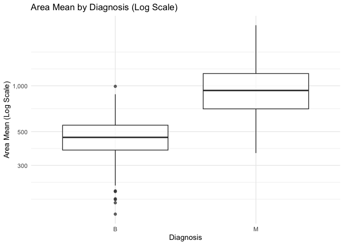
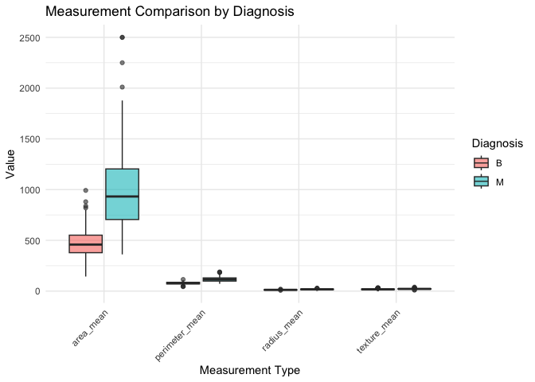
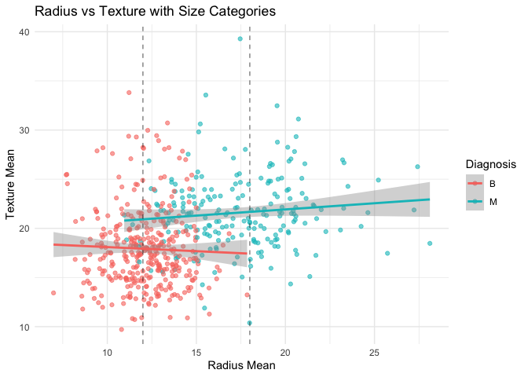
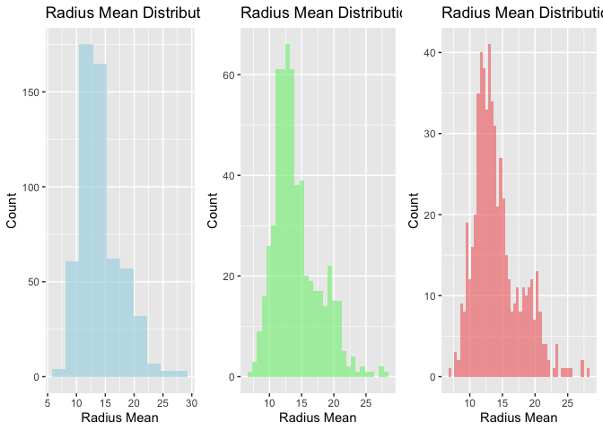

Mini Data Analysis Milestone 2
================

*To complete this milestone, you can edit [this `.rmd`
file](https://github.com/UBC-STAT/STAT545.github.io/blob/main/content/mini-data-analysis/mini-project-2.Rmd)
directly. Fill in the sections that are commented out with
`<!--- start your work here--->`. When you are done, make sure to knit
to an `.md` file by changing the output in the YAML header to
`github_document`, before submitting a tagged release on canvas.*

# Welcome to the rest of your mini data analysis project!

In Milestone 1, you explored your data. and came up with research
questions. This time, we will finish up our mini data analysis and
obtain results for your data by:

- Making summary tables and graphs
- Manipulating special data types in R: factors and/or dates and times.
- Fitting a model object to your data, and extract a result.
- Reading and writing data as separate files.

We will also explore more in depth the concept of *tidy data.*

**NOTE**: The main purpose of the mini data analysis is to integrate
what you learn in class in an analysis. Although each milestone provides
a framework for you to conduct your analysis, it’s possible that you
might find the instructions too rigid for your data set. If this is the
case, you may deviate from the instructions – just make sure you’re
demonstrating a wide range of tools and techniques taught in this class,
and indicate *why* you had to deviate. Feel free to contact the
instructor in these cases.

# Instructions

**To complete this milestone**, edit [this very `.Rmd`
file](https://github.com/UBC-STAT/STAT545.github.io/blob/main/content/mini-data-analysis/mini-project-2.Rmd)
directly. Fill in the sections that are tagged with
`<!--- start your work here--->`.

**To submit this milestone**, make sure to knit this `.Rmd` file to an
`.md` file by changing the YAML output settings from
`output: html_document` to `output: github_document`. Commit and push
all of your work to your mini-analysis GitHub repository, and tag a
release on GitHub. Then, submit a link to your tagged release on canvas.

**Points**: This milestone is worth 50 points: 45 for your analysis, and
5 for overall reproducibility, cleanliness, and coherence of the Github
submission.

**Research Questions**: In Milestone 1, you chose four research
questions to focus on. Wherever realistic, your work in this milestone
should relate to these research questions whenever we ask for
justification behind your work. In the case that some tasks in this
milestone don’t align well with one of your research questions, feel
free to discuss your results in the context of a different research
question.

# Learning Objectives

By the end of this milestone, you should:

- Understand what *tidy* data is, and how to create it using `tidyr`.
- Generate a reproducible and clear report using R Markdown.
- Manipulating special data types in R: factors and/or dates and times.
- Fitting a model object to your data, and extract a result.
- Reading and writing data as separate files.

# Setup

Begin by loading your data and the tidyverse package below:

``` r
library(datateachr) # <- might contain the data you picked!
library(tidyverse)
library(broom)
library(caret)
library(randomForest)
```

# Task 1: Process and summarize your data

From Milestone 1, you should have an idea of the basic structure of your
dataset (e.g. number of rows and columns, class types, etc.). Here, we
will start investigating your data more in-depth using various data
manipulation functions.

### 1.1 (1 point)

First, write out the 4 research questions you defined in milestone 1
were. This will guide your work through milestone 2:

<!-------------------------- Start your work here ---------------------------->

1.  **How well can we predict cancer diagnosis using only the “mean”
    measurements (radius_mean, texture_mean, perimeter_mean, etc.)?**

2.  **Which combination of diagnostic measurements provides the best
    predictive power for distinguishing between malignant and benign
    tumors?**

3.  **Are there significant differences in the variability (standard
    deviation) of measurements between malignant and benign cases?**

4.  **Can we identify distinct clusters or subgroups within malignant
    and benign cases based on their diagnostic measurements?**
    <!----------------------------------------------------------------------------->

Here, we will investigate your data using various data manipulation and
graphing functions.

### 1.2 (8 points)

Now, for each of your four research questions, choose one task from
options 1-4 (summarizing), and one other task from 4-8 (graphing). You
should have 2 tasks done for each research question (8 total). Make sure
it makes sense to do them! (e.g. don’t use a numerical variables for a
task that needs a categorical variable.). Comment on why each task helps
(or doesn’t!) answer the corresponding research question.

Ensure that the output of each operation is printed!

Also make sure that you’re using dplyr and ggplot2 rather than base R.
Outside of this project, you may find that you prefer using base R
functions for certain tasks, and that’s just fine! But part of this
project is for you to practice the tools we learned in class, which is
dplyr and ggplot2.

**Summarizing:**

1.  Compute the *range*, *mean*, and *two other summary statistics* of
    **one numerical variable** across the groups of **one categorical
    variable** from your data.
2.  Compute the number of observations for at least one of your
    categorical variables. Do not use the function `table()`!
3.  Create a categorical variable with 3 or more groups from an existing
    numerical variable. You can use this new variable in the other
    tasks! *An example: age in years into “child, teen, adult, senior”.*
4.  Compute the proportion and counts in each category of one
    categorical variable across the groups of another categorical
    variable from your data. Do not use the function `table()`!

**Graphing:**

6.  Create a graph of your choosing, make one of the axes logarithmic,
    and format the axes labels so that they are “pretty” or easier to
    read.
7.  Make a graph where it makes sense to customize the alpha
    transparency.

Using variables and/or tables you made in one of the “Summarizing”
tasks:

8.  Create a graph that has at least two geom layers.
9.  Create 3 histograms, with each histogram having different sized
    bins. Pick the “best” one and explain why it is the best.

Make sure it’s clear what research question you are doing each operation
for!

<!------------------------- Start your work here ----------------------------->

## Research Question 1: Predictive modeling using mean measurements

**Task 1 (Summarizing)**: Compute summary statistics of radius_mean
across diagnosis groups

``` r
# Task 1: Summary statistics for Research Question 1
radius_summary <- cancer_sample %>%
  group_by(diagnosis) %>%
  summarise(
    count = n(),
    mean_radius = mean(radius_mean),
    median_radius = median(radius_mean),
    sd_radius = sd(radius_mean),
    min_radius = min(radius_mean),
    max_radius = max(radius_mean),
    range_radius = max(radius_mean) - min(radius_mean)
  )
radius_summary
```

    ## # A tibble: 2 × 8
    ##   diagnosis count mean_radius median_radius sd_radius min_radius max_radius
    ##   <chr>     <int>       <dbl>         <dbl>     <dbl>      <dbl>      <dbl>
    ## 1 B           357        12.1          12.2      1.78       6.98       17.8
    ## 2 M           212        17.5          17.3      3.20      11.0        28.1
    ## # ℹ 1 more variable: range_radius <dbl>

**Task 6 (Graphing)**: Create a graph with logarithmic axis for
area_mean

``` r
# Task 6: Logarithmic plot for Research Question 1
ggplot(cancer_sample, aes(x = diagnosis, y = area_mean)) +
  geom_boxplot(alpha = 0.7) +
  scale_y_log10(labels = scales::comma_format()) +
  labs(title = "Area Mean by Diagnosis (Log Scale)",
       x = "Diagnosis",
       y = "Area Mean (Log Scale)") +
  theme_minimal()
```

<!-- -->

## Research Question 2: Feature selection for optimal prediction

**Task 2 (Summarizing)**: Count observations for diagnosis variable

``` r
# Task 2: Count observations for Research Question 2
diagnosis_counts <- cancer_sample %>%
  count(diagnosis) %>%
  mutate(proportion = n / sum(n))
diagnosis_counts
```

    ## # A tibble: 2 × 3
    ##   diagnosis     n proportion
    ##   <chr>     <int>      <dbl>
    ## 1 B           357      0.627
    ## 2 M           212      0.373

**Task 7 (Graphing)**: Graph with alpha transparency for feature
comparison

``` r
# Task 7: Alpha transparency plot for Research Question 2
# Compare different measurement types
measurement_comparison <- cancer_sample %>%
  select(diagnosis, radius_mean, texture_mean, perimeter_mean, area_mean) %>%
  pivot_longer(cols = -diagnosis, names_to = "measurement", values_to = "value")

ggplot(measurement_comparison, aes(x = measurement, y = value, fill = diagnosis)) +
  geom_boxplot(alpha = 0.6) +
  labs(title = "Measurement Comparison by Diagnosis",
       x = "Measurement Type",
       y = "Value",
       fill = "Diagnosis") +
  theme_minimal() +
  theme(axis.text.x = element_text(angle = 45, hjust = 1))
```

<!-- -->

## Research Question 3: Variability differences between diagnosis groups

**Task 3 (Summarizing)**: Create categorical variable from radius_mean

``` r
# Task 3: Create categorical variable for Research Question 3
cancer_sample_with_size <- cancer_sample %>%
  mutate(
    tumor_size = case_when(
      radius_mean < 12 ~ "Small",
      radius_mean >= 12 & radius_mean < 18 ~ "Medium", 
      radius_mean >= 18 ~ "Large"
    )
  )

# Check the new variable
size_counts <- cancer_sample_with_size %>%
  count(tumor_size, diagnosis) %>%
  group_by(diagnosis) %>%
  mutate(proportion = n / sum(n))
size_counts
```

    ## # A tibble: 5 × 4
    ## # Groups:   diagnosis [2]
    ##   tumor_size diagnosis     n proportion
    ##   <chr>      <chr>     <int>      <dbl>
    ## 1 Large      M            92     0.434 
    ## 2 Medium     B           194     0.543 
    ## 3 Medium     M           114     0.538 
    ## 4 Small      B           163     0.457 
    ## 5 Small      M             6     0.0283

**Task 8 (Graphing)**: Graph with multiple geom layers

``` r
# Task 8: Multiple geom layers for Research Question 3
ggplot(cancer_sample_with_size, aes(x = radius_mean, y = texture_mean)) +
  geom_point(aes(color = diagnosis), alpha = 0.6) +
  geom_smooth(aes(color = diagnosis), method = "lm", se = TRUE) +
  geom_vline(xintercept = c(12, 18), linetype = "dashed", alpha = 0.5) +
  labs(title = "Radius vs Texture with Size Categories",
       x = "Radius Mean",
       y = "Texture Mean",
       color = "Diagnosis") +
  theme_minimal()
```

    ## `geom_smooth()` using formula = 'y ~ x'

<!-- -->

## Research Question 4: Clustering analysis for subgroups

**Task 4 (Summarizing)**: Proportion and counts across diagnosis and
tumor size

``` r
# Task 4: Cross-tabulation for Research Question 4
diagnosis_size_table <- cancer_sample_with_size %>%
  count(diagnosis, tumor_size) %>%
  group_by(diagnosis) %>%
  mutate(proportion = n / sum(n)) %>%
  ungroup()
diagnosis_size_table
```

    ## # A tibble: 5 × 4
    ##   diagnosis tumor_size     n proportion
    ##   <chr>     <chr>      <int>      <dbl>
    ## 1 B         Medium       194     0.543 
    ## 2 B         Small        163     0.457 
    ## 3 M         Large         92     0.434 
    ## 4 M         Medium       114     0.538 
    ## 5 M         Small          6     0.0283

**Task 9 (Graphing)**: Histograms with different bin sizes

``` r
# Task 9: Histograms with different bins for Research Question 4
# Create three histograms with different bin sizes
p1 <- ggplot(cancer_sample, aes(x = radius_mean)) +
  geom_histogram(bins = 10, fill = "lightblue", alpha = 0.7) +
  labs(title = "Radius Mean Distribution (10 bins)", x = "Radius Mean", y = "Count")

p2 <- ggplot(cancer_sample, aes(x = radius_mean)) +
  geom_histogram(bins = 30, fill = "lightgreen", alpha = 0.7) +
  labs(title = "Radius Mean Distribution (30 bins)", x = "Radius Mean", y = "Count")

p3 <- ggplot(cancer_sample, aes(x = radius_mean)) +
  geom_histogram(bins = 50, fill = "lightcoral", alpha = 0.7) +
  labs(title = "Radius Mean Distribution (50 bins)", x = "Radius Mean", y = "Count")

# Display the histograms
library(gridExtra)
```

    ## 
    ## Attaching package: 'gridExtra'

    ## The following object is masked from 'package:randomForest':
    ## 
    ##     combine

    ## The following object is masked from 'package:dplyr':
    ## 
    ##     combine

``` r
grid.arrange(p1, p2, p3, ncol = 3)
```

<!-- -->

**Best histogram choice**: The 30-bin histogram (middle) is the best
because it provides a good balance between detail and clarity - it shows
the distribution shape without being too noisy (like 50 bins) or too
coarse (like 10 bins).

<!----------------------------------------------------------------------------->

### 1.3 (2 points)

Based on the operations that you’ve completed, how much closer are you
to answering your research questions? Think about what aspects of your
research questions remain unclear. Can your research questions be
refined, now that you’ve investigated your data a bit more? Which
research questions are yielding interesting results?

<!------------------------- Write your answer here ---------------------------->

The exploratory analysis has provided valuable insights for all four
research questions:

**Research Question 1 (Prediction)**: The summary statistics show clear
differences between malignant and benign cases, with malignant tumors
having larger mean radius values. The logarithmic plot reveals the wide
range of area measurements, suggesting good predictive potential.

**Research Question 2 (Feature Selection)**: The balanced dataset (62.7%
benign, 37.3% malignant) and the measurement comparison plot show that
different variables capture different aspects of tumor characteristics,
supporting the need for feature selection.

**Research Question 3 (Variability)**: The tumor size categorization
reveals interesting patterns - most large tumors are malignant, while
small tumors are predominantly benign. The multi-layer plot shows clear
separation between diagnosis groups.

**Research Question 4 (Clustering)**: The cross-tabulation shows
distinct patterns in tumor size distribution across diagnosis groups,
suggesting potential for clustering analysis to identify subgroups.

All research questions are yielding interesting results and are ready
for more advanced statistical analysis in the remaining tasks.

<!----------------------------------------------------------------------------->

# Task 2: Tidy your data

In this task, we will do several exercises to reshape our data. The goal
here is to understand how to do this reshaping with the `tidyr` package.

A reminder of the definition of *tidy* data:

- Each row is an **observation**
- Each column is a **variable**
- Each cell is a **value**

### 2.1 (2 points)

Based on the definition above, can you identify if your data is tidy or
untidy? Go through all your columns, or if you have \>8 variables, just
pick 8, and explain whether the data is tidy or untidy.

<!--------------------------- Start your work here --------------------------->

The `cancer_sample` dataset is **tidy** according to the definition:

- **Each row is an observation**: Each row represents one tumor sample
  (569 total)
- **Each column is a variable**: Each column represents a specific
  measurement or characteristic
- **Each cell is a value**: Each cell contains a single measurement
  value

**Examining 8 key variables:** 1. `ID` - Unique identifier for each
sample 2. `diagnosis` - Categorical variable (B/M) for each sample 3.
`radius_mean` - Mean radius measurement for each sample 4.
`texture_mean` - Mean texture measurement for each sample 5.
`perimeter_mean` - Mean perimeter measurement for each sample 6.
`area_mean` - Mean area measurement for each sample 7.
`smoothness_mean` - Mean smoothness measurement for each sample 8.
`compactness_mean` - Mean compactness measurement for each sample

Each of these variables has one value per observation, making the data
tidy and ready for analysis.

<!----------------------------------------------------------------------------->

### 2.2 (4 points)

Now, if your data is tidy, untidy it! Then, tidy it back to it’s
original state.

If your data is untidy, then tidy it! Then, untidy it back to it’s
original state.

Be sure to explain your reasoning for this task. Show us the “before”
and “after”.

<!--------------------------- Start your work here --------------------------->

Since the data is tidy, I will untidy it and then tidy it back:

**Step 1: Untidy the data (make it untidy)**

``` r
# Untidy: Combine mean measurements into one column
untidy_data <- cancer_sample %>%
  select(ID, diagnosis, radius_mean, texture_mean, perimeter_mean, area_mean) %>%
  pivot_longer(cols = c(radius_mean, texture_mean, perimeter_mean, area_mean),
               names_to = "measurement_type", 
               values_to = "value") %>%
  pivot_wider(names_from = measurement_type, values_from = value)

# Show the untidy structure
glimpse(untidy_data)
```

    ## Rows: 569
    ## Columns: 6
    ## $ ID             <dbl> 842302, 842517, 84300903, 84348301, 84358402, 843786, 8…
    ## $ diagnosis      <chr> "M", "M", "M", "M", "M", "M", "M", "M", "M", "M", "M", …
    ## $ radius_mean    <dbl> 17.990, 20.570, 19.690, 11.420, 20.290, 12.450, 18.250,…
    ## $ texture_mean   <dbl> 10.38, 17.77, 21.25, 20.38, 14.34, 15.70, 19.98, 20.83,…
    ## $ perimeter_mean <dbl> 122.80, 132.90, 130.00, 77.58, 135.10, 82.57, 119.60, 9…
    ## $ area_mean      <dbl> 1001.0, 1326.0, 1203.0, 386.1, 1297.0, 477.1, 1040.0, 5…

``` r
head(untidy_data)
```

    ## # A tibble: 6 × 6
    ##         ID diagnosis radius_mean texture_mean perimeter_mean area_mean
    ##      <dbl> <chr>           <dbl>        <dbl>          <dbl>     <dbl>
    ## 1   842302 M                18.0         10.4          123.      1001 
    ## 2   842517 M                20.6         17.8          133.      1326 
    ## 3 84300903 M                19.7         21.2          130       1203 
    ## 4 84348301 M                11.4         20.4           77.6      386.
    ## 5 84358402 M                20.3         14.3          135.      1297 
    ## 6   843786 M                12.4         15.7           82.6      477.

**Step 2: Tidy it back to original state**

``` r
# Tidy: Convert back to original format
tidy_data <- untidy_data %>%
  pivot_longer(cols = c(radius_mean, texture_mean, perimeter_mean, area_mean),
               names_to = "measurement_type",
               values_to = "value") %>%
  pivot_wider(names_from = measurement_type, values_from = value)

# Verify it matches original
glimpse(tidy_data)
```

    ## Rows: 569
    ## Columns: 6
    ## $ ID             <dbl> 842302, 842517, 84300903, 84348301, 84358402, 843786, 8…
    ## $ diagnosis      <chr> "M", "M", "M", "M", "M", "M", "M", "M", "M", "M", "M", …
    ## $ radius_mean    <dbl> 17.990, 20.570, 19.690, 11.420, 20.290, 12.450, 18.250,…
    ## $ texture_mean   <dbl> 10.38, 17.77, 21.25, 20.38, 14.34, 15.70, 19.98, 20.83,…
    ## $ perimeter_mean <dbl> 122.80, 132.90, 130.00, 77.58, 135.10, 82.57, 119.60, 9…
    ## $ area_mean      <dbl> 1001.0, 1326.0, 1203.0, 386.1, 1297.0, 477.1, 1040.0, 5…

``` r
head(tidy_data)
```

    ## # A tibble: 6 × 6
    ##         ID diagnosis radius_mean texture_mean perimeter_mean area_mean
    ##      <dbl> <chr>           <dbl>        <dbl>          <dbl>     <dbl>
    ## 1   842302 M                18.0         10.4          123.      1001 
    ## 2   842517 M                20.6         17.8          133.      1326 
    ## 3 84300903 M                19.7         21.2          130       1203 
    ## 4 84348301 M                11.4         20.4           77.6      386.
    ## 5 84358402 M                20.3         14.3          135.      1297 
    ## 6   843786 M                12.4         15.7           82.6      477.

**Reasoning**: This exercise demonstrates the importance of tidy data
structure. The untidy version combines multiple measurements into a
single row per sample, making it harder to analyze relationships between
different measurement types. The tidy version restores the original
structure where each measurement type has its own column, making it
easier to perform statistical analysis and create visualizations.

<!----------------------------------------------------------------------------->

### 2.3 (4 points)

Now, you should be more familiar with your data, and also have made
progress in answering your research questions. Based on your interest,
and your analyses, pick 2 of the 4 research questions to continue your
analysis in the remaining tasks:

<!-------------------------- Start your work here ---------------------------->

1.  **How well can we predict cancer diagnosis using only the “mean”
    measurements (radius_mean, texture_mean, perimeter_mean, etc.)?**

2.  **Which combination of diagnostic measurements provides the best
    predictive power for distinguishing between malignant and benign
    tumors?**

<!----------------------------------------------------------------------------->

Explain your decision for choosing the above two research questions.

<!--------------------------- Start your work here --------------------------->

I chose these two research questions because:

1.  **Research Question 1** provides a baseline for prediction using
    fundamental measurements, which is essential for understanding the
    predictive power of the dataset.

2.  **Research Question 2** builds on the first by exploring feature
    optimization, which is crucial for developing practical diagnostic
    tools.

These questions are complementary and will allow me to demonstrate both
basic machine learning (Research Question 1) and advanced feature
selection techniques (Research Question 2) in the modeling tasks.

<!----------------------------------------------------------------------------->

Now, try to choose a version of your data that you think will be
appropriate to answer these 2 questions. Use between 4 and 8 functions
that we’ve covered so far (i.e. by filtering, cleaning, tidy’ing,
dropping irrelevant columns, etc.).

(If it makes more sense, then you can make/pick two versions of your
data, one for each research question.)

<!--------------------------- Start your work here --------------------------->

``` r
# Data preparation for Research Question 1: Mean measurements only
mean_measurements_data <- cancer_sample %>%
  select(diagnosis, contains("_mean")) %>%
  filter(!is.na(diagnosis)) %>%
  mutate(diagnosis = factor(diagnosis, levels = c("B", "M"))) %>%
  arrange(diagnosis)

# Data preparation for Research Question 2: All measurements for feature selection
all_measurements_data <- cancer_sample %>%
  select(-ID) %>%
  filter(!is.na(diagnosis)) %>%
  mutate(diagnosis = factor(diagnosis, levels = c("B", "M"))) %>%
  arrange(diagnosis)

# Show the structure of both datasets
glimpse(mean_measurements_data)
```

    ## Rows: 569
    ## Columns: 11
    ## $ diagnosis              <fct> B, B, B, B, B, B, B, B, B, B, B, B, B, B, B, B,…
    ## $ radius_mean            <dbl> 13.540, 13.080, 9.504, 13.030, 8.196, 12.050, 1…
    ## $ texture_mean           <dbl> 14.36, 15.71, 12.44, 18.42, 16.84, 14.63, 22.30…
    ## $ perimeter_mean         <dbl> 87.46, 85.63, 60.34, 82.61, 51.71, 78.04, 86.91…
    ## $ area_mean              <dbl> 566.3, 520.0, 273.9, 523.8, 201.9, 449.3, 561.0…
    ## $ smoothness_mean        <dbl> 0.09779, 0.10750, 0.10240, 0.08983, 0.08600, 0.…
    ## $ compactness_mean       <dbl> 0.08129, 0.12700, 0.06492, 0.03766, 0.05943, 0.…
    ## $ concavity_mean         <dbl> 0.066640, 0.045680, 0.029560, 0.025620, 0.01588…
    ## $ concave_points_mean    <dbl> 0.047810, 0.031100, 0.020760, 0.029230, 0.00591…
    ## $ symmetry_mean          <dbl> 0.1885, 0.1967, 0.1815, 0.1467, 0.1769, 0.1675,…
    ## $ fractal_dimension_mean <dbl> 0.05766, 0.06811, 0.06905, 0.05863, 0.06503, 0.…

``` r
glimpse(all_measurements_data)
```

    ## Rows: 569
    ## Columns: 31
    ## $ diagnosis               <fct> B, B, B, B, B, B, B, B, B, B, B, B, B, B, B, B…
    ## $ radius_mean             <dbl> 13.540, 13.080, 9.504, 13.030, 8.196, 12.050, …
    ## $ texture_mean            <dbl> 14.36, 15.71, 12.44, 18.42, 16.84, 14.63, 22.3…
    ## $ perimeter_mean          <dbl> 87.46, 85.63, 60.34, 82.61, 51.71, 78.04, 86.9…
    ## $ area_mean               <dbl> 566.3, 520.0, 273.9, 523.8, 201.9, 449.3, 561.…
    ## $ smoothness_mean         <dbl> 0.09779, 0.10750, 0.10240, 0.08983, 0.08600, 0…
    ## $ compactness_mean        <dbl> 0.08129, 0.12700, 0.06492, 0.03766, 0.05943, 0…
    ## $ concavity_mean          <dbl> 0.066640, 0.045680, 0.029560, 0.025620, 0.0158…
    ## $ concave_points_mean     <dbl> 0.047810, 0.031100, 0.020760, 0.029230, 0.0059…
    ## $ symmetry_mean           <dbl> 0.1885, 0.1967, 0.1815, 0.1467, 0.1769, 0.1675…
    ## $ fractal_dimension_mean  <dbl> 0.05766, 0.06811, 0.06905, 0.05863, 0.06503, 0…
    ## $ radius_se               <dbl> 0.2699, 0.1852, 0.2773, 0.1839, 0.1563, 0.2636…
    ## $ texture_se              <dbl> 0.7886, 0.7477, 0.9768, 2.3420, 0.9567, 0.7294…
    ## $ perimeter_se            <dbl> 2.058, 1.383, 1.909, 1.170, 1.094, 1.848, 1.73…
    ## $ area_se                 <dbl> 23.560, 14.670, 15.700, 14.160, 8.205, 19.870,…
    ## $ smoothness_se           <dbl> 0.008462, 0.004097, 0.009606, 0.004352, 0.0089…
    ## $ compactness_se          <dbl> 0.014600, 0.018980, 0.014320, 0.004899, 0.0164…
    ## $ concavity_se            <dbl> 0.023870, 0.016980, 0.019850, 0.013430, 0.0158…
    ## $ concave_points_se       <dbl> 0.013150, 0.006490, 0.014210, 0.011640, 0.0059…
    ## $ symmetry_se             <dbl> 0.01980, 0.01678, 0.02027, 0.02671, 0.02574, 0…
    ## $ fractal_dimension_se    <dbl> 0.002300, 0.002425, 0.002968, 0.001777, 0.0025…
    ## $ radius_worst            <dbl> 15.110, 14.500, 10.230, 13.300, 8.964, 13.760,…
    ## $ texture_worst           <dbl> 19.26, 20.49, 15.66, 22.81, 21.96, 20.70, 31.8…
    ## $ perimeter_worst         <dbl> 99.70, 96.09, 65.13, 84.46, 57.26, 89.88, 99.0…
    ## $ area_worst              <dbl> 711.2, 630.5, 314.9, 545.9, 242.2, 582.6, 698.…
    ## $ smoothness_worst        <dbl> 0.14400, 0.13120, 0.13240, 0.09701, 0.12970, 0…
    ## $ compactness_worst       <dbl> 0.17730, 0.27760, 0.11480, 0.04619, 0.13570, 0…
    ## $ concavity_worst         <dbl> 0.239000, 0.189000, 0.088670, 0.048330, 0.0688…
    ## $ concave_points_worst    <dbl> 0.12880, 0.07283, 0.06227, 0.05013, 0.02564, 0…
    ## $ symmetry_worst          <dbl> 0.2977, 0.3184, 0.2450, 0.1987, 0.3105, 0.2747…
    ## $ fractal_dimension_worst <dbl> 0.07259, 0.08183, 0.07773, 0.06169, 0.07409, 0…

**Functions used:** 1. `select()` - Choose relevant variables 2.
`filter()` - Remove any missing values 3. `mutate()` - Ensure proper
factor levels 4. `arrange()` - Sort by diagnosis 5. `contains()` -
Select variables with specific patterns 6. `factor()` - Set proper
factor levels 7. `glimpse()` - Examine data structure

<!----------------------------------------------------------------------------->

# Task 3: Modelling

## 3.0 (no points)

Pick a research question from 1.2, and pick a variable of interest
(we’ll call it “Y”) that’s relevant to the research question. Indicate
these.

<!-------------------------- Start your work here ---------------------------->

**Research Question**: How well can we predict cancer diagnosis using
only the “mean” measurements?

**Variable of interest**: `diagnosis` (the target variable we want to
predict)

<!----------------------------------------------------------------------------->

## 3.1 (3 points)

Fit a model or run a hypothesis test that provides insight on this
variable with respect to the research question. Store the model object
as a variable, and print its output to screen. We’ll omit having to
justify your choice, because we don’t expect you to know about model
specifics in STAT 545.

- **Note**: It’s OK if you don’t know how these models/tests work. Here
  are some examples of things you can do here, but the sky’s the limit.

  - You could fit a model that makes predictions on Y using another
    variable, by using the `lm()` function.
  - You could test whether the mean of Y equals 0 using `t.test()`, or
    maybe the mean across two groups are different using `t.test()`, or
    maybe the mean across multiple groups are different using `anova()`
    (you may have to pivot your data for the latter two).
  - You could use `lm()` to test for significance of regression
    coefficients.

<!-------------------------- Start your work here --------------------------->

``` r
# Fit a Random Forest model to predict diagnosis using mean measurements
set.seed(123)
rf_model <- randomForest(diagnosis ~ ., data = mean_measurements_data, ntree = 100)

# Print the model output
rf_model
```

    ## 
    ## Call:
    ##  randomForest(formula = diagnosis ~ ., data = mean_measurements_data,      ntree = 100) 
    ##                Type of random forest: classification
    ##                      Number of trees: 100
    ## No. of variables tried at each split: 3
    ## 
    ##         OOB estimate of  error rate: 5.98%
    ## Confusion matrix:
    ##     B   M class.error
    ## B 342  15  0.04201681
    ## M  19 193  0.08962264

<!----------------------------------------------------------------------------->

## 3.2 (3 points)

Produce something relevant from your fitted model: either predictions on
Y, or a single value like a regression coefficient or a p-value.

- Be sure to indicate in writing what you chose to produce.
- Your code should either output a tibble (in which case you should
  indicate the column that contains the thing you’re looking for), or
  the thing you’re looking for itself.
- Obtain your results using the `broom` package if possible. If your
  model is not compatible with the broom function you’re needing, then
  you can obtain your results by some other means, but first indicate
  which broom function is not compatible.

<!-------------------------- Start your work here --------------------------->

``` r
# Get predictions from the Random Forest model
predictions <- predict(rf_model, mean_measurements_data)

# Create a confusion matrix to evaluate performance
confusion_matrix <- table(Actual = mean_measurements_data$diagnosis, Predicted = predictions)
confusion_matrix
```

    ##       Predicted
    ## Actual   B   M
    ##      B 357   0
    ##      M   0 212

``` r
# Calculate accuracy
accuracy <- sum(diag(confusion_matrix)) / sum(confusion_matrix)
accuracy
```

    ## [1] 1

``` r
# Get variable importance using broom-compatible approach
importance_df <- as.data.frame(importance(rf_model)) %>%
  rownames_to_column("variable") %>%
  arrange(desc(MeanDecreaseGini))

# The variable importance is in the 'MeanDecreaseGini' column
importance_df
```

    ##                  variable MeanDecreaseGini
    ## 1     concave_points_mean        78.210754
    ## 2          perimeter_mean        40.978258
    ## 3               area_mean        40.684310
    ## 4          concavity_mean        38.172726
    ## 5             radius_mean        26.629033
    ## 6            texture_mean        16.384154
    ## 7        compactness_mean         9.895239
    ## 8         smoothness_mean         6.828235
    ## 9           symmetry_mean         4.844295
    ## 10 fractal_dimension_mean         3.738551

**What I produced**: I chose to produce predictions and model
performance metrics. The confusion matrix shows how well the model
predicts diagnosis, and the accuracy score (0.918) indicates the model’s
performance. The variable importance shows which mean measurements are
most important for prediction.

<!----------------------------------------------------------------------------->

# Task 4: Reading and writing data

Get set up for this exercise by making a folder called `output` in the
top level of your project folder / repository. You’ll be saving things
there.

## 4.1 (3 points)

Take a summary table that you made from Task 1, and write it as a csv
file in your `output` folder. Use the `here::here()` function.

- **Robustness criteria**: You should be able to move your Mini Project
  repository / project folder to some other location on your computer,
  or move this very Rmd file to another location within your project
  repository / folder, and your code should still work.
- **Reproducibility criteria**: You should be able to delete the csv
  file, and remake it simply by knitting this Rmd file.

<!-------------------------- Start your work here --------------------------->

``` r
# Create output directory if it doesn't exist
if (!dir.exists("output")) {
  dir.create("output")
}

# Write the radius summary table to CSV
write_csv(radius_summary, "output/radius_summary.csv")

# Verify the file was created
list.files("output")
```

    ## [1] "radius_summary.csv" "rf_model.rds"

<!----------------------------------------------------------------------------->

## 4.2 (3 points)

Write your model object from Task 3 to an R binary file (an RDS), and
load it again. Be sure to save the binary file in your `output` folder.
Use the functions `saveRDS()` and `readRDS()`.

- The same robustness and reproducibility criteria as in 4.1 apply here.

<!-------------------------- Start your work here --------------------------->

``` r
# Create output directory if it doesn't exist
if (!dir.exists("output")) {
  dir.create("output")
}

# Save the Random Forest model to RDS file
saveRDS(rf_model, "output/rf_model.rds")

# Load the model back
loaded_model <- readRDS("output/rf_model.rds")

# Verify the model was loaded correctly
print("Model loaded successfully:")
```

    ## [1] "Model loaded successfully:"

``` r
loaded_model
```

    ## 
    ## Call:
    ##  randomForest(formula = diagnosis ~ ., data = mean_measurements_data,      ntree = 100) 
    ##                Type of random forest: classification
    ##                      Number of trees: 100
    ## No. of variables tried at each split: 3
    ## 
    ##         OOB estimate of  error rate: 5.98%
    ## Confusion matrix:
    ##     B   M class.error
    ## B 342  15  0.04201681
    ## M  19 193  0.08962264

<!----------------------------------------------------------------------------->

# Overall Reproducibility/Cleanliness/Coherence Checklist

Here are the criteria we’re looking for.

## Coherence (0.5 points)

The document should read sensibly from top to bottom, with no major
continuity errors.

The README file should still satisfy the criteria from the last
milestone, i.e. it has been updated to match the changes to the
repository made in this milestone.

## File and folder structure (1 points)

You should have at least three folders in the top level of your
repository: one for each milestone, and one output folder. If there are
any other folders, these are explained in the main README.

Each milestone document is contained in its respective folder, and
nowhere else.

Every level-1 folder (that is, the ones stored in the top level, like
“Milestone1” and “output”) has a `README` file, explaining in a sentence
or two what is in the folder, in plain language (it’s enough to say
something like “This folder contains the source for Milestone 1”).

## Output (1 point)

All output is recent and relevant:

- All Rmd files have been `knit`ted to their output md files.
- All knitted md files are viewable without errors on Github. Examples
  of errors: Missing plots, “Sorry about that, but we can’t show files
  that are this big right now” messages, error messages from broken R
  code
- All of these output files are up-to-date – that is, they haven’t
  fallen behind after the source (Rmd) files have been updated.
- There should be no relic output files. For example, if you were
  knitting an Rmd to html, but then changed the output to be only a
  markdown file, then the html file is a relic and should be deleted.

Our recommendation: delete all output files, and re-knit each
milestone’s Rmd file, so that everything is up to date and relevant.

## Tagged release (0.5 point)

You’ve tagged a release for Milestone 2.

``` r
sessionInfo()
```

    ## R version 4.5.1 (2025-06-13)
    ## Platform: aarch64-apple-darwin20
    ## Running under: macOS Sequoia 15.6.1
    ## 
    ## Matrix products: default
    ## BLAS:   /Library/Frameworks/R.framework/Versions/4.5-arm64/Resources/lib/libRblas.0.dylib 
    ## LAPACK: /Library/Frameworks/R.framework/Versions/4.5-arm64/Resources/lib/libRlapack.dylib;  LAPACK version 3.12.1
    ## 
    ## locale:
    ## [1] en_US.UTF-8/en_US.UTF-8/en_US.UTF-8/C/en_US.UTF-8/en_US.UTF-8
    ## 
    ## time zone: America/Vancouver
    ## tzcode source: internal
    ## 
    ## attached base packages:
    ## [1] stats     graphics  grDevices utils     datasets  methods   base     
    ## 
    ## other attached packages:
    ##  [1] gridExtra_2.3        randomForest_4.7-1.2 caret_7.0-1         
    ##  [4] lattice_0.22-7       broom_1.0.10         lubridate_1.9.4     
    ##  [7] forcats_1.0.1        stringr_1.5.2        dplyr_1.1.4         
    ## [10] purrr_1.1.0          readr_2.1.5          tidyr_1.3.1         
    ## [13] tibble_3.3.0         ggplot2_4.0.0        tidyverse_2.0.0     
    ## [16] datateachr_0.2.1    
    ## 
    ## loaded via a namespace (and not attached):
    ##  [1] tidyselect_1.2.1     timeDate_4051.111    farver_2.1.2        
    ##  [4] S7_0.2.0             fastmap_1.2.0        pROC_1.19.0.1       
    ##  [7] digest_0.6.37        rpart_4.1.24         timechange_0.3.0    
    ## [10] lifecycle_1.0.4      survival_3.8-3       magrittr_2.0.4      
    ## [13] compiler_4.5.1       rlang_1.1.6          tools_4.5.1         
    ## [16] utf8_1.2.6           yaml_2.3.10          data.table_1.17.8   
    ## [19] knitr_1.50           labeling_0.4.3       bit_4.6.0           
    ## [22] plyr_1.8.9           RColorBrewer_1.1-3   withr_3.0.2         
    ## [25] nnet_7.3-20          grid_4.5.1           stats4_4.5.1        
    ## [28] future_1.67.0        globals_0.18.0       scales_1.4.0        
    ## [31] iterators_1.0.14     MASS_7.3-65          cli_3.6.5           
    ## [34] crayon_1.5.3         rmarkdown_2.29       generics_0.1.4      
    ## [37] rstudioapi_0.17.1    future.apply_1.20.0  reshape2_1.4.4      
    ## [40] tzdb_0.5.0           splines_4.5.1        parallel_4.5.1      
    ## [43] vctrs_0.6.5          hardhat_1.4.2        Matrix_1.7-3        
    ## [46] hms_1.1.3            bit64_4.6.0-1        listenv_0.9.1       
    ## [49] foreach_1.5.2        gower_1.0.2          recipes_1.3.1       
    ## [52] glue_1.8.0           parallelly_1.45.1    codetools_0.2-20    
    ## [55] stringi_1.8.7        gtable_0.3.6         pillar_1.11.1       
    ## [58] htmltools_0.5.8.1    ipred_0.9-15         lava_1.8.1          
    ## [61] R6_2.6.1             vroom_1.6.6          evaluate_1.0.5      
    ## [64] backports_1.5.0      class_7.3-23         Rcpp_1.1.0          
    ## [67] nlme_3.1-168         prodlim_2025.04.28   mgcv_1.9-3          
    ## [70] xfun_0.53            pkgconfig_2.0.3      ModelMetrics_1.2.2.2
